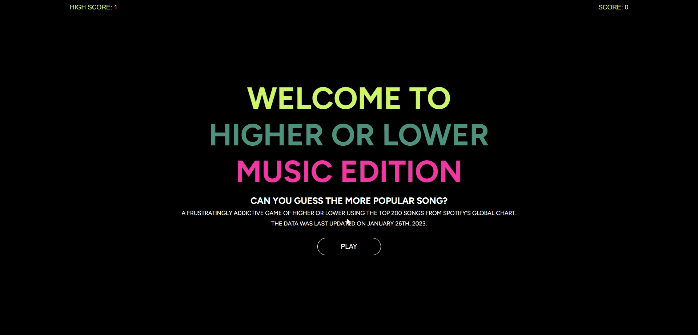
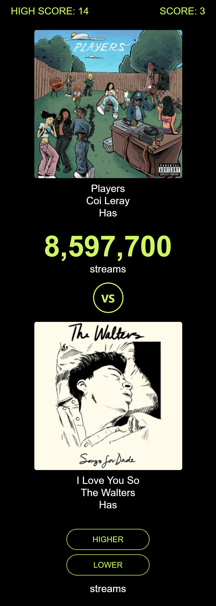

# higher-lower-game
A frustratingly addictive game of higher or lower using the top 200 songs from Spotify's global chart.

https://higherlower.onrender.com/

## About The App

Based on the popular browser game of the same name, this iteration of higher or lower challenges the user to guess which song currently ranks higher or lower on Spotify's global top 200 chart.

## Getting Started

### Prerequisites
To run locally one will need to have a mongoDB account with which they can use a connection string to connect to a database.

The connection string will look like this and will be saved under the variable name "DATABASE_URL" in an .env file.

    DATABASE_URL = mongodb+srv://<username>:<password>@cluster0.hbovlsj.mongodb.net/<database-name>

### Installation
1. Clone the respository:

        git clone git@github.com:ken862734801/higher-or-lower.git

2. Install NPM packages:

        npm install

3. Run the NPM start command:

    The root package.json contains "concurrently" as a dev dependency to allow for the server and client initialization to occur at the same time. 

        npm run start

## Deployment

As listed above, the live preview for the application is currently hosted on Render. Render is a unified cloud to build and run apps and websites with free TLS certificates, global CDN, DDos protection, private networks, and built in auto deploys from Git. 

https://render.com/

As of right now this is being deployed under a paid tier so there should be no issues with up time; however, this could change in the future so it is recommend to run the application locally for the best experience.

## Built Using

This application was built using MongoDB, Express, React, and Node. Python was also used for functionality related to filtering the original data obtained from the Spotify API into a more concise format. The newly filter array of objects is then returned as a JSON file, which was used to seed the MongoDB database. 

https://developer.spotify.com/documentation/web-api/

## Future Development

- Implement different game modes depending on genres and regions.
- Implement a counter animation upon the reveal of song streams.
