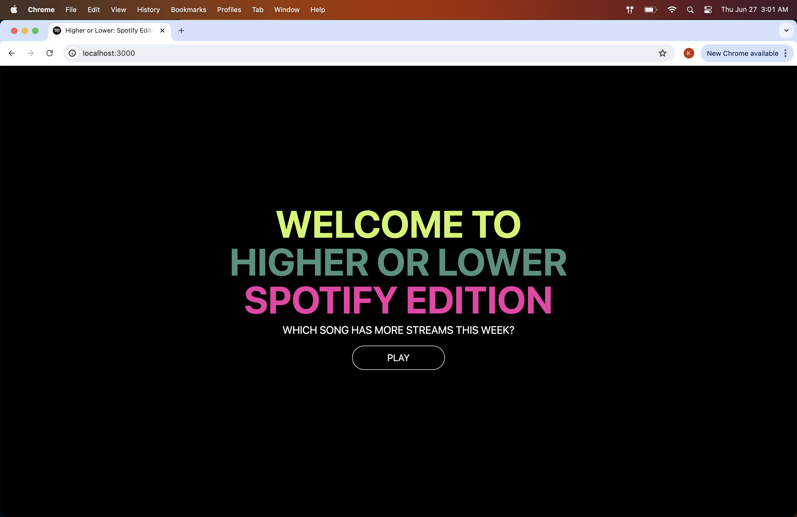

# Higher or Lower Spotify

A browser game using React, where users guess which of two songs has a higher weekly stream count on Spotify.

[Live Demo](https://higher-or-lower-spotify.vercel.app/)

## Getting Started

### Prerequisites

Before you can run the project, ensure you have the following installed:

1. Node - https://nodejs.org/en/download/package-manager

2. Yarn - https://yarnpkg.com/getting-started/install

### Installing

To clone the repository, run:

    git@github.com:<USERNAME>/higher-or-lower-spotify.git

To install the necessary dependencies, run:

    yarn install
    
### Executing program

To start the development server, run: 

    yarn dev

By default, the app will open in your web browser at [http://localhost:3000](http://localhost:3000)

### Unit Test

To run the unit tests, run:

    yarn test

